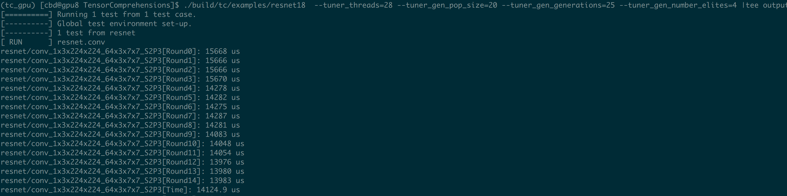

## TC per-layer

### Install

### How-to-run

1. Without autotuning

   ```bash
   ./build/tc/example/resnet50 |tee output
   ```
2. With autotuning

   ```bash
   ./build/tc/example/resnet50 --tuner_threads=28 --tuner_gen_pop_size=20 --tuner_gen_generations=25 --tuner_gen_number_elites=4 |tee output
   ```

3. Run each convolution kernel for 15 times, and collect the last 10 times

   

4. Get the time data

   ```bash
   grep Time output | grep -oE '(conv|depthwise)_[a-zA-Z0-9_]+' # get conv name
   grep Time output |awk '{print $2}' # get time
   ```
